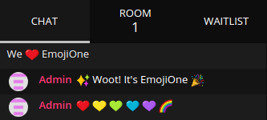

# u-wave-web-emojione

[EmojiOne][] emoji for the [üWave web client][] chat.



## Installation

```bash
npm install --save u-wave-web-emojione
```

Alternatively, use the [üWave CLI].

## Usage

Adding `u-wave-web-emojione` to your instance is a three-step process:

```js
import express from 'express';
import createWebClient from 'u-wave-web';
// 1. Add this import 👇
import emojione from 'u-wave-web-emojione';

const app = express();
// ...
// (Your application setup here)
// ...

// 2. Add this middleware:
app.use('/assets/emoji', emojione.middleware());
app.use(createWebClient(uw, {
  // 3. Add the emoji list:
  emoji: emojione.emoji,
}));
```

If you are already using other emoji sets, you can use multiple by adding more
router handlers and merging the emoji lists.

```js
import serveStatic from 'serve-static';
app.use('/assets/emoji', serveStatic('./my-custom-emoji'));
app.use('/assets/emoji', emojione.middleware());
app.use(createWebClient(uw, {
  emoji: Object.assign(
    {},
    emojione.emoji,
    myCustomEmoji
  ),
}));
```

## License

[EmojiOne][] emoji images are available under the [EmojiOne Free License][].

Everything else in this repository is available under the [MIT][] license.

[EmojiOne]: http://emojione.com/
[EmojiOne Free License]: https://www.emojione.com/developers/free-license
[MIT]: https://opensource.org/licenses/MIT
[üWave web client]: https://github.com/u-wave/web
[üWave CLI]: https://github.com/u-wave/cli
